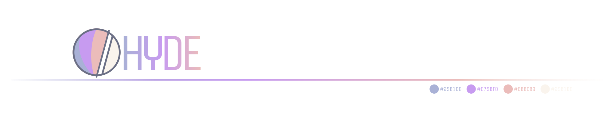
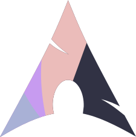
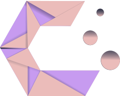
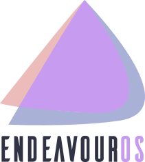
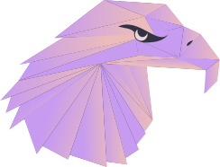
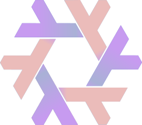

<div align = center>
    <a href="https://discord.gg/AYbJ9MJez7">

    </a>
</div>

###### _<div align="right"><a id=-design-by-t2></a><sub>// design by t2</sub></div>_



<!--
Multi-language KEYBINDINGS support
-->

[](../../../KEYBINDINGS.md)
[](./KEYBINDINGS.es.md)
[](./KEYBINDINGS.de.md)
[](./KEYBINDINGS.nl.md)
[](./KEYBINDINGS.zh.md)
[](./KEYBINDINGS.fr.md)
[](./KEYBINDINGS.ar.md)

<div align="center">

<br>

<!-- <a href=#hyde-keybindings><kbd> <br> HyDE keybindings <br> </kbd></a>&ensp;&ensp; -->

<a href=#window-management><kbd> <br> Gerenciamento de Janelas <br> </kbd></a>&ensp;&ensp;
<a href=#misc><kbd> <br> Diversos <br> </kbd></a>&ensp;&ensp;
<a href=#launcher><kbd> <br> Inicializador <br> </kbd></a>&ensp;&ensp;
<a href=#hardware-controls><kbd> <br> Controles de Hardware <br> </kbd></a>&ensp;&ensp;
<a href=#utilities><kbd> <br> Utilitários <br> </kbd></a>&ensp;&ensp;
<a href="#theming-and-wallpaper"><kbd> <br> Temas e Papel de Parede <br> </kbd></a>&ensp;&ensp;
<a href=#workspaces><kbd> <br> Áreas de Trabalho <br> </kbd></a>&ensp;&ensp;

</div><br><br>

<div align="center">
  <div style="display: flex; flex-wrap: nowrap; justify-content: center;">
    
    
    
    
    
  </div>
</div>

<!-- # <a id=hyde-keybindings>DOORwayDE Keybindings</a> -->
<!-- # <a id=hyde-keybindings></a> -->

Aqui estão todos os atalhos de teclado específicos do HyDE listados.

> [!TIP]  
> <kbd>Super</kbd> + <kbd>/</kbd> mostra os atalhos de teclado.

<!-- ## <a id=window-management>Window Management</a> -->

## <a id=window-management></a>

| Teclas                                               | Ação                                |
| :--------------------------------------------------- | :---------------------------------- |
| <kbd>CTRL</kbd> + <kbd>Q</kbd>                       | fechar a janela em foco             |
| <kbd>ALT</kbd> + <kbd>F4</kbd>                       | fechar a janela em foco             |
| <kbd>SUPER</kbd> + <kbd>Delete</kbd>                 | encerrar a sessão do hyprland       |
| <kbd>SUPER</kbd> + <kbd>W</kbd>                      | alternar modo flutuante             |
| <kbd>SUPER</kbd> + <kbd>G</kbd>                      | alternar grupo                      |
| <kbd>Shift</kbd> + <kbd>F11</kbd>                    | alternar tela cheia                 |
| <kbd>SUPER</kbd> + <kbd>L</kbd>                      | bloquear a tela                     |
| <kbd>SUPER</kbd> + <kbd>SHIFT</kbd> + <kbd>F</kbd>   | fixar/soltar janela em foco         |
| <kbd>ALT</kbd> + <kbd>CTRL</kbd> + <kbd>Delete</kbd> | menu de logout                      |
| <kbd>ALT</kbd> + <kbd>Control_R</kbd>                | alternar waybar e recarregar config |
| <kbd>SUPER</kbd> + <kbd>J</kbd>                      | alternar divisão                    |

### Navegação entre Grupos

| Teclas                                            | Ação                              |
| :------------------------------------------------ | :-------------------------------- |
| <kbd>SUPER</kbd> + <kbd>CTRL</kbd> + <kbd>H</kbd> | mudar grupo ativo para o anterior |
| <kbd>SUPER</kbd> + <kbd>CTRL</kbd> + <kbd>L</kbd> | mudar grupo ativo para o próximo  |

### Mudar foco

| Teclas                              | Ação             |
| :---------------------------------- | :--------------- |
| <kbd>SUPER</kbd> + <kbd>Left</kbd>  | focar à esquerda |
| <kbd>SUPER</kbd> + <kbd>Right</kbd> | focar à direita  |
| <kbd>SUPER</kbd> + <kbd>Up</kbd>    | focar para cima  |
| <kbd>SUPER</kbd> + <kbd>Down</kbd>  | focar para baixo |
| <kbd>ALT</kbd> + <kbd>Tab</kbd>     | ciclar foco      |

### Redimensionar Janela Ativa

| Teclas                                                 | Ação                            |
| :----------------------------------------------------- | :------------------------------ |
| <kbd>SUPER</kbd> + <kbd>SHIFT</kbd> + <kbd>Right</kbd> | Redimensionar Janela Ativa      |
| <kbd>SUPER</kbd> + <kbd>SHIFT</kbd> + <kbd>Left</kbd>  | Redimensionar Janela Ativa      |
| <kbd>SUPER</kbd> + <kbd>SHIFT</kbd> + <kbd>Up</kbd>    | Redimensionar Janela Ativa      |
| <kbd>SUPER</kbd> + <kbd>SHIFT</kbd> + <kbd>Down</kbd>  | redimensionar janela para baixo |

### Mover e Redimensionar com o mouse

| Teclas                                    | Ação                             |
| :-------------------------------------- | :--------------------------------- |
| <kbd>SUPER</kbd> + <kbd>mouse:272</kbd> | segure para mover a janela         |
| <kbd>SUPER</kbd> + <kbd>mouse:273</kbd> | segure para redimensionar a janela |
| <kbd>SUPER</kbd> + <kbd>Z</kbd>         | segure para redimensionar a janela |
| <kbd>SUPER</kbd> + <kbd>X</kbd>         | segure para redimensionar a janela |

<!-- ## <a id=misc>Misc</a> -->

## <a id=misc></a>

| Teclas                                                                   | Ação                                 |
| :----------------------------------------------------------------------- | :----------------------------------- |
| <kbd>SUPER</kbd> + <kbd>CTRL</kbd> + <kbd>SHIFT</kbd> + <kbd>left</kbd>  | mover a janela ativa para a esquerda |
| <kbd>SUPER</kbd> + <kbd>CTRL</kbd> + <kbd>SHIFT</kbd> + <kbd>right</kbd> | mover a janela ativa para a direita  |
| <kbd>SUPER</kbd> + <kbd>CTRL</kbd> + <kbd>SHIFT</kbd> + <kbd>up</kbd>    | mover a janela ativa para cima       |
| <kbd>SUPER</kbd> + <kbd>CTRL</kbd> + <kbd>SHIFT</kbd> + <kbd>down</kbd>  | mover a janela ativa para baixo      |

<!-- ## <a id=launcher>Launcher</a> -->

## <a id=launcher></a>

### Aplicativos

| Teclas                                                 | Ação                   |
| :----------------------------------------------------- | :--------------------- |
| <kbd>SUPER</kbd> + <kbd>T</kbd>                        | emulador de terminal   |
| <kbd>SUPER</kbd> + <kbd>ALT</kbd> + <kbd>T</kbd>       | terminal suspenso      |
| <kbd>SUPER</kbd> + <kbd>E</kbd>                        | explorador de arquivos |
| <kbd>SUPER</kbd> + <kbd>C</kbd>                        | editor de texto        |
| <kbd>SUPER</kbd> + <kbd>B</kbd>                        | navegador web          |
| <kbd>CTRL</kbd> + <kbd>SHIFT</kbd> + <kbd>Escape</kbd> | monitor do sistema     |

### Menus do Rofi

| Teclas                                             | Ação                                 |
| :------------------------------------------------- | :----------------------------------- |
| <kbd>SUPER</kbd> + <kbd>A</kbd>                    | localizador de aplicativos           |
| <kbd>SUPER</kbd> + <kbd>TAB</kbd>                  | alternador de janelas                |
| <kbd>SUPER</kbd> + <kbd>SHIFT</kbd> + <kbd>E</kbd> | localizador de arquivos              |
| <kbd>SUPER</kbd> + <kbd>slash</kbd>                | dica de atalhos                      |
| <kbd>SUPER</kbd> + <kbd>comma</kbd>                | seletor de emojis                    |
| <kbd>SUPER</kbd> + <kbd>period</kbd>               | seletor de glifos                    |
| <kbd>SUPER</kbd> + <kbd>V</kbd>                    | área de transferência                |
| <kbd>SUPER</kbd> + <kbd>SHIFT</kbd> + <kbd>V</kbd> | gerenciador da área de transferência |
| <kbd>SUPER</kbd> + <kbd>SHIFT</kbd> + <kbd>A</kbd> | selecionar inicializador do rofi     |

<!-- ## <a id="hardware-controls">Hardware Controls</a> -->

## <a id="hardware-controls"></a>

### Áudio

| Teclas                                            | Ação                               |
| :------------------------------------------------ | :--------------------------------- |
| <kbd>None</kbd> + <kbd>F10</kbd>                  | ativar/desativar mudo da saída     |
| <kbd>None</kbd> + <kbd>XF86AudioMute</kbd>        | ativar/desativar mudo da saída     |
| <kbd>None</kbd> + <kbd>F11</kbd>                  | diminuir volume                    |
| <kbd>None</kbd> + <kbd>F12</kbd>                  | aumentar volume                    |
| <kbd>None</kbd> + <kbd>XF86AudioMicMute</kbd>     | ativar/desativar mudo do microfone |
| <kbd>None</kbd> + <kbd>XF86AudioLowerVolume</kbd> | diminuir volume                    |
| <kbd>None</kbd> + <kbd>XF86AudioRaiseVolume</kbd> | aumentar volume                    |

### Mídia

| Teclas                                      | Ação             |
| :------------------------------------------ | :--------------- |
| <kbd>None</kbd> + <kbd>XF86AudioPlay</kbd>  | reproduzir mídia |
| <kbd>None</kbd> + <kbd>XF86AudioPause</kbd> | pausar mídia     |
| <kbd>None</kbd> + <kbd>XF86AudioNext</kbd>  | próxima mídia    |
| <kbd>None</kbd> + <kbd>XF86AudioPrev</kbd>  | mídia anterior   |

### Brilho

| Teclas                                             | Ação            |
| :------------------------------------------------- | :-------------- |
| <kbd>None</kbd> + <kbd>XF86MonBrightnessUp</kbd>   | aumentar brilho |
| <kbd>None</kbd> + <kbd>XF86MonBrightnessDown</kbd> | diminuir brilho |

<!-- ## <a id=utilities>Utilities</a> -->

## <a id=utilities></a>

| Teclas                                           | Ação                       |
| :----------------------------------------------- | :------------------------- |
| <kbd>SUPER</kbd> + <kbd>K</kbd>                  | alternar layout do teclado |
| <kbd>SUPER</kbd> + <kbd>ALT</kbd> + <kbd>G</kbd> | modo de jogo               |

### Captura de Tela

| Teclas                                             | Ação                     |
| :------------------------------------------------- | :----------------------- |
| <kbd>SUPER</kbd> + <kbd>SHIFT</kbd> + <kbd>P</kbd> | seletor de cor           |
| <kbd>SUPER</kbd> + <kbd>P</kbd>                    | recorte da tela          |
| <kbd>SUPER</kbd> + <kbd>CTRL</kbd> + <kbd>P</kbd>  | congelar e recortar tela |
| <kbd>SUPER</kbd> + <kbd>ALT</kbd> + <kbd>P</kbd>   | imprimir monitor         |
| <kbd>None</kbd> + <kbd>Print</kbd>                 | imprimir todas as telas  |

<!-- ## <a id=theming-and-wallpaper>Theming and Wallpaper</a> -->

## <a id=theming-and-wallpaper></a>

| Teclas                                               | Ação                          |
| :--------------------------------------------------- | :---------------------------- |
| <kbd>SUPER</kbd> + <kbd>ALT</kbd> + <kbd>Right</kbd> | próximo papel de parede       |
| <kbd>SUPER</kbd> + <kbd>ALT</kbd> + <kbd>Left</kbd>  | papel de parede anterior      |
| <kbd>SUPER</kbd> + <kbd>SHIFT</kbd> + <kbd>W</kbd>   | selecionar papel de parede    |
| <kbd>SUPER</kbd> + <kbd>ALT</kbd> + <kbd>Up</kbd>    | próximo layout do waybar      |
| <kbd>SUPER</kbd> + <kbd>ALT</kbd> + <kbd>Down</kbd>  | layout anterior do waybar     |
| <kbd>SUPER</kbd> + <kbd>SHIFT</kbd> + <kbd>R</kbd>   | seletor do modo wallbash      |
| <kbd>SUPER</kbd> + <kbd>SHIFT</kbd> + <kbd>T</kbd>   | selecionar tema               |
| <kbd>SUPER</kbd> + <kbd>SHIFT</kbd> + <kbd>Y</kbd>   | selecionar animações          |
| <kbd>SUPER</kbd> + <kbd>SHIFT</kbd> + <kbd>U</kbd>   | selecionar layout do hyprlock |

<!-- ## <a id=workspaces>Workspaces</a> -->

## <a id=workspaces></a>

### Navegação

| Teclas                                               | Ação                                               |
| :--------------------------------------------------- | :------------------------------------------------- |
| <kbd>SUPER</kbd> + <kbd>1</kbd>                      | navegar para a área de trabalho 1                  |
| <kbd>SUPER</kbd> + <kbd>2</kbd>                      | navegar para a área de trabalho 2                  |
| <kbd>SUPER</kbd> + <kbd>3</kbd>                      | navegar para a área de trabalho 3                  |
| <kbd>SUPER</kbd> + <kbd>4</kbd>                      | navegar para a área de trabalho 4                  |
| <kbd>SUPER</kbd> + <kbd>5</kbd>                      | navegar para a área de trabalho 5                  |
| <kbd>SUPER</kbd> + <kbd>6</kbd>                      | navegar para a área de trabalho 6                  |
| <kbd>SUPER</kbd> + <kbd>7</kbd>                      | navegar para a área de trabalho 7                  |
| <kbd>SUPER</kbd> + <kbd>8</kbd>                      | navegar para a área de trabalho 8                  |
| <kbd>SUPER</kbd> + <kbd>9</kbd>                      | navegar para a área de trabalho 9                  |
| <kbd>SUPER</kbd> + <kbd>0</kbd>                      | navegar para a área de trabalho 10                 |
| <kbd>SUPER</kbd> + <kbd>CTRL</kbd> + <kbd>Down</kbd> | navegar para a área de trabalho vazia mais próxima |
| <kbd>SUPER</kbd> + <kbd>mouse_down</kbd>             | próxima área de trabalho                           |
| <kbd>SUPER</kbd> + <kbd>mouse_up</kbd>               | área de trabalho anterior                          |

#### Área de trabalho relativa

| Teclas                                                | Ação                                         |
| :---------------------------------------------------- | :------------------------------------------- |
| <kbd>SUPER</kbd> + <kbd>CTRL</kbd> + <kbd>Right</kbd> | mudar área de trabalho ativa para a próxima  |
| <kbd>SUPER</kbd> + <kbd>CTRL</kbd> + <kbd>Left</kbd>  | mudar área de trabalho ativa para a anterior |

#### Área de trabalho especial

| Teclas                                             | Ação                                 |
| :------------------------------------------------- | :----------------------------------- |
| <kbd>SUPER</kbd> + <kbd>SHIFT</kbd> + <kbd>S</kbd> | mover para o scratchpad              |
| <kbd>SUPER</kbd> + <kbd>ALT</kbd> + <kbd>S</kbd>   | mover para o scratchpad (silencioso) |
| <kbd>SUPER</kbd> + <kbd>S</kbd>                    | alternar scratchpad                  |

#### Mover janela silenciosamente

| Teclas                                           | Ação                                          |
| :----------------------------------------------- | :-------------------------------------------- |
| <kbd>SUPER</kbd> + <kbd>ALT</kbd> + <kbd>1</kbd> | mover para a área de trabalho 1 (silencioso)  |
| <kbd>SUPER</kbd> + <kbd>ALT</kbd> + <kbd>2</kbd> | mover para a área de trabalho 2 (silencioso)  |
| <kbd>SUPER</kbd> + <kbd>ALT</kbd> + <kbd>3</kbd> | mover para a área de trabalho 3 (silencioso)  |
| <kbd>SUPER</kbd> + <kbd>ALT</kbd> + <kbd>4</kbd> | mover para a área de trabalho 4 (silencioso)  |
| <kbd>SUPER</kbd> + <kbd>ALT</kbd> + <kbd>5</kbd> | mover para a área de trabalho 5 (silencioso)  |
| <kbd>SUPER</kbd> + <kbd>ALT</kbd> + <kbd>6</kbd> | mover para a área de trabalho 6 (silencioso)  |
| <kbd>SUPER</kbd> + <kbd>ALT</kbd> + <kbd>7</kbd> | mover para a área de trabalho 7 (silencioso)  |
| <kbd>SUPER</kbd> + <kbd>ALT</kbd> + <kbd>8</kbd> | mover para a área de trabalho 8 (silencioso)  |
| <kbd>SUPER</kbd> + <kbd>ALT</kbd> + <kbd>9</kbd> | mover para a área de trabalho 9 (silencioso)  |
| <kbd>SUPER</kbd> + <kbd>ALT</kbd> + <kbd>0</kbd> | mover para a área de trabalho 10 (silencioso) |

### Mover janela para a área de trabalho

| Teclas                                             | Ação                             |
| :------------------------------------------------- | :------------------------------- |
| <kbd>SUPER</kbd> + <kbd>SHIFT</kbd> + <kbd>1</kbd> | mover para a área de trabalho 1  |
| <kbd>SUPER</kbd> + <kbd>SHIFT</kbd> + <kbd>2</kbd> | mover para a área de trabalho 2  |
| <kbd>SUPER</kbd> + <kbd>SHIFT</kbd> + <kbd>3</kbd> | mover para a área de trabalho 3  |
| <kbd>SUPER</kbd> + <kbd>SHIFT</kbd> + <kbd>4</kbd> | mover para a área de trabalho 4  |
| <kbd>SUPER</kbd> + <kbd>SHIFT</kbd> + <kbd>5</kbd> | mover para a área de trabalho 5  |
| <kbd>SUPER</kbd> + <kbd>SHIFT</kbd> + <kbd>6</kbd> | mover para a área de trabalho 6  |
| <kbd>SUPER</kbd> + <kbd>SHIFT</kbd> + <kbd>7</kbd> | mover para a área de trabalho 7  |
| <kbd>SUPER</kbd> + <kbd>SHIFT</kbd> + <kbd>8</kbd> | mover para a área de trabalho 8  |
| <kbd>SUPER</kbd> + <kbd>SHIFT</kbd> + <kbd>9</kbd> | mover para a área de trabalho 9  |
| <kbd>SUPER</kbd> + <kbd>SHIFT</kbd> + <kbd>0</kbd> | mover para a área de trabalho 10 |

| Teclas                                                                 | Ação                                                   |
| :--------------------------------------------------------------------- | :----------------------------------------------------- |
| <kbd>SUPER</kbd> + <kbd>ALT</kbd> + <kbd>CTRL</kbd> + <kbd>Right</kbd> | mover janela para a próxima área de trabalho relativa  |
| <kbd>SUPER</kbd> + <kbd>ALT</kbd> + <kbd>CTRL</kbd> + <kbd>Left</kbd>  | mover janela para a área de trabalho relativa anterior |

## <a id="custom-keybindings"></a>

Você pode definir seus próprios atalhos de teclado editando o arquivo de preferências em:

```bash
~/.config/hypr/userprefs.conf
```

Por exemplo, para criar um atalho que abre o **HyDE Game Launcher**, adicione a seguinte linha:

```ini
bind = $mainMod, SPACE, exec, $HOME/.local/lib/doorwayde/gamelauncher.sh
```

Isto irá vincular o **Game Launcher** à combinação <kbd>SUPER</kbd> + <kbd>Space</kbd>.  
Você pode substituir `SPACE` por qualquer outra tecla que preferir.

O script `gamelauncher.sh` está incluído por padrão e fica em:

```bash
~/.local/lib/doorwayde/gamelauncher.sh
```

<!--
<div align="right">
  <br>
  <a href="#-design-by-t2"><kbd> <br> 🡅 <br> </kbd></a>
</div>

<div align="center">

</div>
-->

<div align="right">
  <br>
  <a href="#-design-by-t2"><kbd> <br> 🡅 <br> </kbd></a>
</div>

<div align="right">
  <sub>Última edição em: 01/02/2025<span id="last-edited"></span></sub>
</div>

